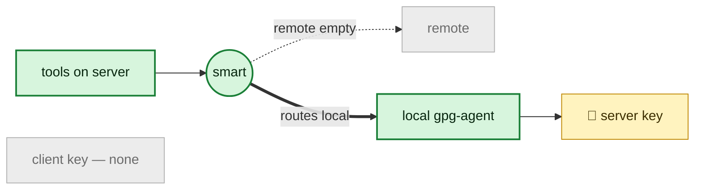
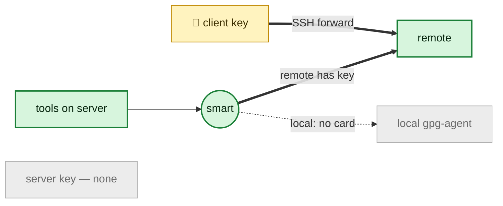
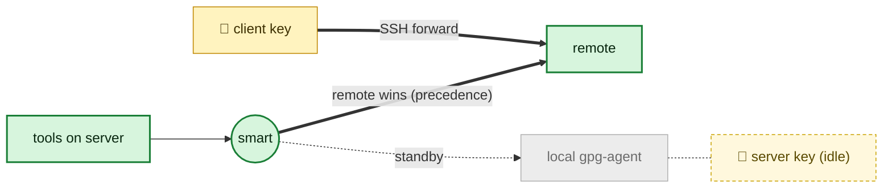
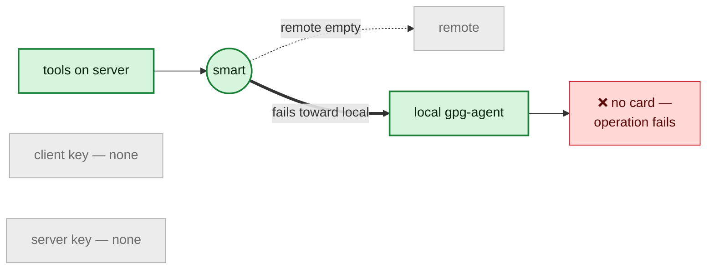
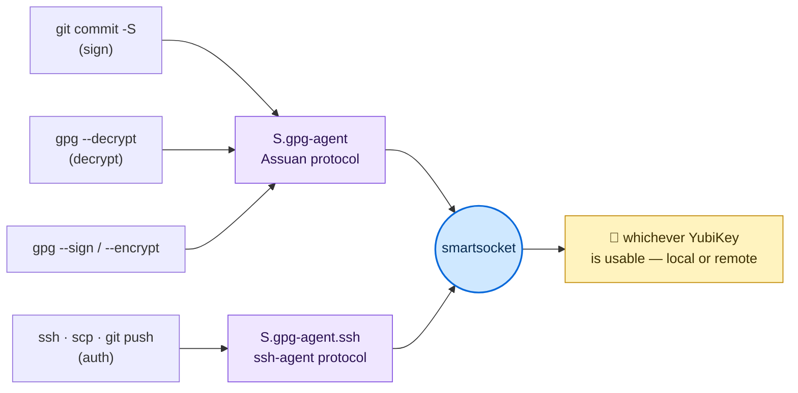
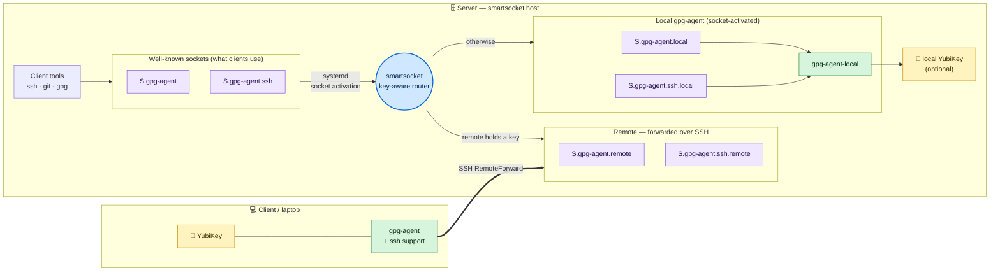
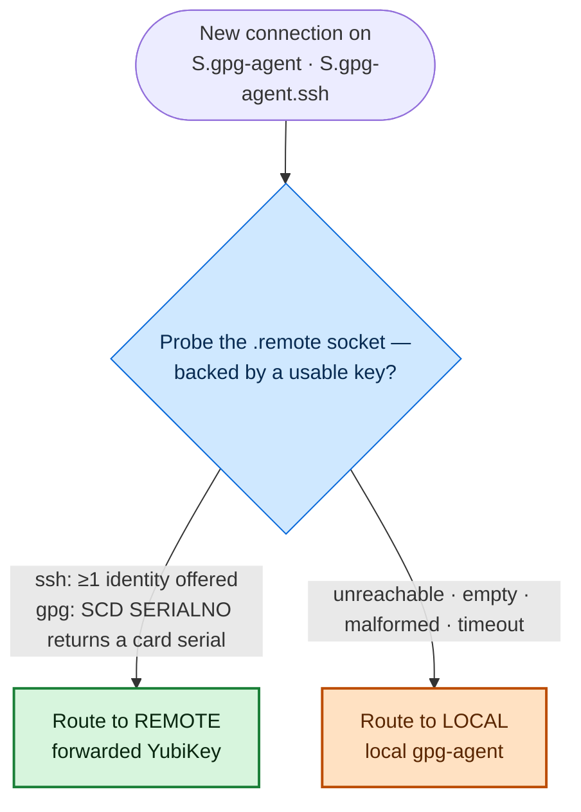
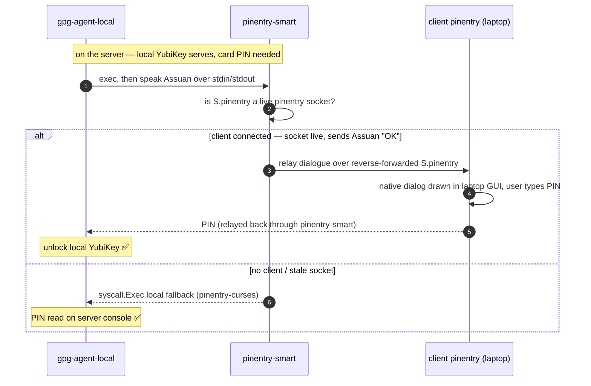

# smartsocket

**Use a YubiKey (or local keys) for GPG and SSH auth and signing — seamlessly,
whether the key is plugged into the machine in front of you or forwarded over
SSH from somewhere else.**

> **New to YubiKeys?** If you haven't set up a YubiKey for GPG signing and SSH
> auth yet, start with the **[YubiKey Setup Guide](docs/yubikey-setup.md)** — it
> walks you from a blank key all the way to signing and authenticating, then
> hands back here for the remote-forwarding setup.

`smartsocket` is a socket-activated router that sits in front of the standard
`gpg-agent` and `ssh-agent` sockets. Your tools always connect to the same
well-known paths; behind them, `smartsocket` figures out *where the usable key
actually is* — a remotely forwarded YubiKey, a local one, or both — and routes
each request to the right agent. PIN prompts are sent back to your own client's
native pinentry, so signing and decryption Just Work no matter which end the key
lives on.

- **Drop-in** — occupies the normal socket paths; nothing downstream needs to
  know it exists.
- **Key-aware** — routes on whether a key can actually sign, not just whether
  a socket is open.
- **Local-or-remote** — prefers a forwarded key when present, falls back to a
  local one automatically.
- **GPG *and* SSH** — one router for both the Assuan signing socket and the
  ssh-agent auth socket.

## How `smartsocket` compares

One socket path, the right key — whether your YubiKey is plugged into the
machine in front of you or three SSH hops away.

Forwarding a hardware key to a remote host has always been a choice between two
half-solutions. [`ssh-agent-switcher`][sas] gives you a **stable socket path**
that proxies to whatever forwarded agent happens to be live — great for
surviving `tmux`, but SSH-only and blind to whether the key behind that socket
can actually do anything. The classic [gpg-agent-over-SSH recipe][gpgfwd]
(`RemoteForward … S.gpg-agent.extra` + `StreamLocalBindUnlink yes`) handles GPG
signing, but it's a brittle, hand-rolled dance where a remote gpg-agent will
happily autostart and steal your forwarded socket out from under you.

**`smartsocket` sits at the intersection of those two ideas** — proxy-to-a-stable-path
*and* the gpg-agent forwarding recipe — then adds the two things neither has:

- **Key-presence routing.** Instead of picking the first socket that merely
  *opens*, `smartsocket` probes for a genuinely usable key (`SCD SERIALNO` for
  GPG, an offered identity for SSH) and routes to the one that can actually sign.
- **Graceful local fallback with native-pinentry forwarding.** Remote key
  present? Use it. Only a local YubiKey? Fall back to it automatically. PIN
  prompts are forwarded back to *your* client's native pinentry via
  `pinentry-smart` — no matter which end the key lives on.

The result: your tooling always talks to the same socket, and `smartsocket`
quietly makes sure it's backed by a key that works — local or remote, GPG or SSH.

### Feature comparison

| | **smartsocket** | [ssh-agent-switcher][sas] | [manual gpg-agent forward][gpgfwd] | 1Password SSH agent |
|---|:---:|:---:|:---:|:---:|
| SSH auth routing | ✅ | ✅ | ✅ | ✅ |
| GPG / Assuan signing | ✅ | ❌ SSH only | ✅ | ❌ SSH only |
| Routes on **key presence** (not just an open socket) | ✅ | ❌ first socket that opens | ❌ whatever's forwarded | ⚠️ partial |
| Automatic **local fallback** when the remote is keyless | ✅ | ❌ | ❌ manual | ❌ |
| Dual-key **precedence** (remote › local) | ✅ | ❌ | ❌ | via ssh-config conditionals |
| Pinentry forwarded to the **client's** native prompt | ✅ `pinentry-smart` | ❌ | ❌ | ✅ (app-native) |
| Survives `tmux` / stale `SSH_AUTH_SOCK` | ✅ | ✅ | ❌ | ✅ |
| Transparent — no per-host config | ✅ systemd socket activation | ⚠️ minimal | ❌ fiddly per-host | ⚠️ low, but closed |
| Open source | ✅ Go | ✅ Go | ✅ built-in tooling | ❌ commercial |

<sub>Comparison reflects each tool's primary design goal; the adjacent projects
are excellent at what they set out to do — `smartsocket` just targets a
different sweet spot.</sub>

[sas]: https://github.com/jmmv/ssh-agent-switcher
[gpgfwd]: https://wiki.gnupg.org/AgentForwarding


# Overview

Installs a socket router which chooses local or remote sockets for GPG
signing and authentication based on availability.

Problem:

I want to leave my desk, taking my YubiKey with me, and have both auth
(ssh connections) and signing (git commits) work when connecting remotely over
an ssh connection.

I should also be able to use the desktop/server directly, key plugged in as
normal, whether or not there exists an active ssh connection from a client with
a key inserted.

Solution:

A socket proxy replacing the standard GPG sockets which intelligently
routes ssh auth and gpg signing requests to either the local agent, or to auth
forwarded socket from a remote connection.

## Use Cases

SSH Authentication and signing should work when either local to a stationary
desktop/server where smartsocket is installed, or when connecting from
a remote client such as a laptop or other physically distant server.

Each case is just a different answer to one question — *does the remote hold a
usable key?* (see [How It Works](#how-it-works) for the probe). In the diagrams:
**green** = the path that lights up, **grey** = dormant, **🔑 amber** = a key
that's physically present.

### When Local:
When server-local (not connected remotely via ssh) I am able to make SSH
connections and sign git commits using a YubiKey plugged in locally.

The remote socket isn't forwarded (no session), so the probe finds nothing and
smartsocket routes to the local gpg-agent and its YubiKey.



### When Remote - Single Key:
When in physical posession of the key, I should be able to ssh and sign:
- Locally on the connecting client as usual
- Remotely over an ssh connection (via agent forwarding) using the key in my
  posession.

The key rides your SSH session onto the server; smartsocket probes the forwarded
socket, sees a usable key, and routes remote. The server needs no key of its own.



### When Remote - Dual Keys:
When both in possession of a key, and a duplicate key is left inserted in the
server, I should be able to ssh auth and sign commits:
- Locally on the connecting client using the key connected to the client.
- Remotely on the server over the ssh connection using the key connected to
  the client, taking precedence over the key connected to the server.
- If the server's key is removed, it should seamlessly transition to the
  single key use case above.

The forwarded key wins by precedence; the server's own key sits idle on standby.
Pull the client key (even while the session lingers) and the next probe finds the
remote empty, so smartsocket seamlessly falls back to the idle server key.



### When Neither (no key anywhere):
No key is forwarded and none is plugged into the server. The remote probe finds
nothing, so smartsocket still **fails toward local** — but the local agent has no
card either, so the operation simply fails (as it should). Nothing is silently
proxied to a keyless agent.



**Note:** Routing is based on **key presence**, not merely socket availability.
If the remote socket is connectable but its agent holds no usable key — e.g. you
SSH in without your key, or pull it while the session lingers — smartsocket
automatically falls back to the local key. Remote takes precedence only when it
actually carries a usable key (ssh: an offered identity; gpg: a reachable card).
To force local while a *keyed* remote is connected, disconnect the session.


## How It Works

Your tools always connect to the **same two well-known sockets**. Behind them,
`smartsocket` decides — per connection — which agent actually holds a usable key.

### One router, many uses

Everything that needs your key funnels through just two protocol sockets — the
Assuan socket (`S.gpg-agent`) for signing/decryption and the ssh-agent socket
(`S.gpg-agent.ssh`) for authentication — and `smartsocket` backs both with
whichever YubiKey is currently usable, local or remote.



### Socket activation + key-aware routing

systemd owns the well-known paths and hands each accepted connection to
`smartsocket`, which proxies it to the **remote** (forwarded from a laptop over
SSH) or the **local** gpg-agent. The laptop reaches the remote sockets via
`RemoteForward`; the local sockets are themselves socket-activated in front of a
dedicated `gpg-agent-local`.



### The routing decision

For each connection, smartsocket probes the `.remote` socket: it must be
connectable **and** hold a usable key (ssh-agent: at least one offered identity;
gpg/Assuan: a card serial from `SCD SERIALNO`). If so, it proxies to remote;
otherwise — remote unreachable, connectable-but-empty, or any probe
error/timeout — it **fails toward local**.



**No configuration needed** — clients use standard socket paths and smartsocket
handles the routing transparently.

## Installation

```bash
make install
make enable
```

This will:
1. Install the smartsocket binary and systemd units
2. Mask the original gpg-agent socket units
3. Enable the smartsocket and local gpg-agent socket units

## Socket Paths

**Standard paths (intercepted by smartsocket):**
- `/run/user/1000/gnupg/S.gpg-agent` - GPG operations
- `/run/user/1000/gnupg/S.gpg-agent.ssh` - SSH authentication

**Remote sockets (forwarded from laptop via SSH):**
- `/run/user/1000/gnupg/S.gpg-agent.remote`
- `/run/user/1000/gnupg/S.gpg-agent.ssh.remote`

**Local sockets (local gpg-agent fallback):**
- `/run/user/1000/gnupg/S.gpg-agent.local`
- `/run/user/1000/gnupg/S.gpg-agent.ssh.local`

## SSH Client Configuration (Laptop)

On the machine you SSH *from* (e.g., your laptop with the YubiKey), configure
SSH to forward both gpg-agent sockets.

### Prerequisites

Ensure gpg-agent is running with SSH support on your laptop:

```bash
# ~/.gnupg/gpg-agent.conf
enable-ssh-support
```

### SSH Config

Add to `~/.ssh/config` on your laptop:

```
Host myserver
    # Forward GPG agent socket (for signing)
    RemoteForward /run/user/1000/gnupg/S.gpg-agent.remote /path/to/local/S.gpg-agent

    # Forward SSH agent socket
    RemoteForward /run/user/1000/gnupg/S.gpg-agent.ssh.remote /path/to/local/S.gpg-agent.ssh

    # Allow SSH to overwrite stale sockets on reconnect
    StreamLocalBindUnlink yes
```

### Finding Your Local Socket Paths

```bash
# GPG socket
gpgconf --list-dirs agent-socket
# Linux: /run/user/1000/gnupg/S.gpg-agent
# macOS: /Users/username/.gnupg/S.gpg-agent

# SSH socket
gpgconf --list-dirs agent-ssh-socket
# Linux: /run/user/1000/gnupg/S.gpg-agent.ssh
# macOS: /Users/username/.gnupg/S.gpg-agent.ssh
```

### Server-Side sshd Configuration

On the target machine, ensure `/etc/ssh/sshd_config` includes:

```
StreamLocalBindUnlink yes
```

This allows SSH to clean up stale forwarded sockets on reconnect.

## Shell Configuration

Set `SSH_AUTH_SOCK` to the standard path in your shell config:

```bash
# .bashrc / .zshrc
export SSH_AUTH_SOCK=/run/user/1000/gnupg/S.gpg-agent.ssh
```

```nu
# config.nu
$env.SSH_AUTH_SOCK = "/run/user/1000/gnupg/S.gpg-agent.ssh"
```

## Pinentry Forwarding

When the **local** key serves (no remote connected, or the remote is keyless),
gpg-agent needs the local card's PIN. On a headless / windowless server the default
curses pinentry is awkward (and unusable for a non-interactive agent). `pinentry-smart`
instead forwards the PIN prompt to the **client's native pinentry** (e.g.
`pinentry-mac`) over a reverse-forwarded socket, falling back to a local pinentry when
no client is connected. It rides the client's existing **outbound** SSH session — no
inbound SSH to the client, and no credential stored on the server.



`make install` builds and installs `pinentry-smart` to `~/.local/bin/`.

### Server (where smartsocket runs)

Point gpg-agent at the wrapper and reload. **The path must be absolute** —
gpg-agent spawns `pinentry-program` directly with **no PATH search**, so a bare
name (`pinentry-smart`) fails with `can't connect to the PIN entry module …:
IPC connect call failed` / `No pinentry`.

```
# ~/.gnupg/gpg-agent.conf
pinentry-program /home/<you>/.local/bin/pinentry-smart
```

```bash
systemctl --user restart gpg-agent-local.service   # re-read the config
```

`pinentry-smart` forwards to the client iff `/run/user/<uid>/gnupg/S.pinentry` is a
live pinentry (i.e. the client is connected and its responder is up); otherwise it
execs the local fallback (`/usr/bin/pinentry-curses` by default). Both are overridable
via `PINENTRY_SMART_SOCKET` and `PINENTRY_SMART_FALLBACK`.

### Client (the machine you SSH from)

Reverse-forward a pinentry socket back to the server (alongside the gpg-agent
forwards), and run a small responder that hands each connection to your native
pinentry. In `~/.ssh/config`, under the server's `Host` block:

```
RemoteForward /run/user/1000/gnupg/S.pinentry /Users/<you>/.hamr/pinentry.sock
StreamLocalBindUnlink yes
```

Run the responder **in your GUI login session** so the native dialog can draw —
test it from a GUI terminal first:

```bash
socat UNIX-LISTEN:$HOME/.hamr/pinentry.sock,fork,unlink-early EXEC:$(which pinentry-mac)
```

`socat` is the listener-and-launcher: the SSH `RemoteForward` delivers to a *socket*,
but `pinentry-mac` speaks Assuan on stdin/stdout — so `UNIX-LISTEN` gives the forward a
target and `EXEC` spawns a fresh `pinentry-mac` per connection with the socket wired to
its stdio (`fork` = one per PIN request). It runs silently; the popup is the output.

Once proven, make it permanent with a user **LaunchAgent** (`~/Library/LaunchAgents/
io.kingland.hamr.pinentry.plist`, `RunAtLoad`+`KeepAlive`, args `socat UNIX-LISTEN:…
EXEC:…/pinentry-mac`) — it stays in the GUI session and survives reconnects/reboots.

With the session up, the server's local-card PIN prompt pops as your native pinentry;
with it down, the server falls back to its local pinentry automatically (the forwarded
socket disappears on disconnect via `StreamLocalBindUnlink`).

## Known Issues

### Free-running gpg-agent steals smartsocket's sockets

Symptom: connections via `S.gpg-agent` or `S.gpg-agent.ssh` bypass
smartsocket and hit a local gpg-agent instead — e.g. `ssh-add -L`
returns "no identities" or only the local key when a remote key
should be in play. `ss -lxn | grep S.gpg-agent` shows two listeners
on the same path (smartsocket's, backlog 4096; the rogue's, backlog
64).

Note: since smartsocket became key-aware, "only the local key when a
remote key should be in play" can *also* be smartsocket correctly
falling back to local because the remote probe found no usable key
(empty remote agent, or a slow forward that exceeded the probe
deadline) — not a steal. The **two-listeners** check above is the
discriminator: two listeners on one path = rogue steal (recover
below); a single listener = smartsocket's own key-aware decision
(check the remote actually holds a key / isn't laggy).

Cause: any process that runs `gpg-agent --use-standard-socket --daemon`
(directly or via `gpgconf --launch gpg-agent`, or via `gpg-connect-agent`
without `--no-autostart`) will `unlink()` smartsocket's socket file at
`/run/user/<uid>/gnupg/S.gpg-agent{,.ssh}` and re-bind its own listener
there. systemd's listener inode survives in the kernel but the
filesystem path now points to the rogue, so smartsocket is bypassed.

Recovery: restart the smartsocket socket units so they re-bind the
filesystem paths.

```bash
pkill -f 'gpg-agent.*--daemon'
systemctl --user restart smartsocket-gpg.socket smartsocket-ssh.socket
```

Prevention: keep shell rc files and SSH config from auto-launching
gpg-agent.

- Remove `gpgconf --launch gpg-agent` from shell startup (`.bashrc`,
  `config.nu`, etc.) — smartsocket + `gpg-agent-local.service` are
  socket-activated, so no explicit launch is needed.
- If you have a `Match host * exec "gpg-connect-agent UPDATESTARTUPTTY
  /bye"` block in `~/.ssh/config` for pinentry-tty integration, add
  `--no-autostart`:
  ```
  Match host * exec "gpg-connect-agent --no-autostart UPDATESTARTUPTTY /bye"
  ```

## Management

```bash
make status    # Check all socket and service status
make disable   # Stop smartsocket and restore original gpg-agent
make enable    # Enable smartsocket (masks original gpg-agent)
make uninstall # Remove everything
```

## Standalone Mode

For testing or non-systemd systems, smartsocket can run in standalone mode
where it creates its own `.smart` suffixed sockets:

```bash
./smartsocket
```

In standalone mode, you'll need to configure clients to use the `.smart` paths.

## Systemd Units

**Smartsocket:**
- `smartsocket-gpg.socket` - Listens on `S.gpg-agent`
- `smartsocket-ssh.socket` - Listens on `S.gpg-agent.ssh`
- `smartsocket.service` - The proxy service

**Local gpg-agent:**
- `gpg-agent-local.socket` - Listens on `S.gpg-agent.local`
- `gpg-agent-ssh-local.socket` - Listens on `S.gpg-agent.ssh.local`
- `gpg-agent-local.service` - Local gpg-agent instance
