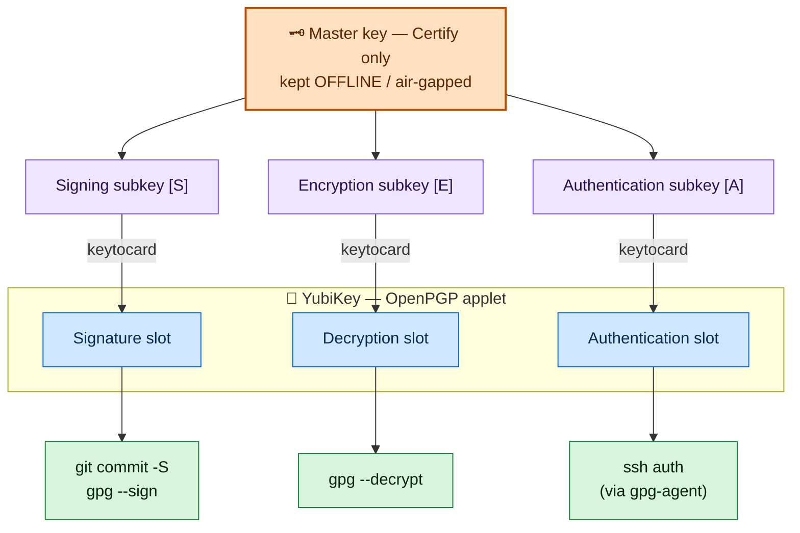

# YubiKey Setup for GPG + SSH

*A companion to [smartsocket](../README.md).* smartsocket routes GPG signing and
SSH authentication to a YubiKey — but it assumes you **already have a YubiKey that
holds your keys**. This guide gets you there from a blank key: you'll generate a
GPG keypair, move its subkeys onto a YubiKey, and wire up GPG signing and SSH
auth. At the end there's a short hand-off back to smartsocket for using the key
remotely.

If you already have a working GPG-on-YubiKey setup (you can `git commit -S` and
`ssh` with the key plugged in), skip straight to
[Using it with smartsocket](#using-it-with-smartsocket).

> This guide is deliberately self-contained. For a deeper, security-hardened
> treatment — offline master keys, hardened `gpg.conf`, OS-specific notes — see
> the excellent [drduh/YubiKey-Guide](https://github.com/drduh/YubiKey-Guide),
> which this walkthrough is aligned with.

---

## The key model

The design that makes a YubiKey useful here: **one certify-only master key that
lives offline, and three subkeys that live on the YubiKey.**

- The **master key** can only *certify* (create and sign subkeys/identities). You
  generate it once, back it up, and keep it off your daily machines — ideally
  air-gapped. Compromising a daily machine can't reach it.
- Three **subkeys** do the day-to-day work — one each for **S**ign, **E**ncrypt,
  and **A**uthenticate. These are moved onto the YubiKey, where the private halves
  can never be extracted. Your machine holds only *stubs* (pointers that say "this
  key lives on card serial X").
- **SSH auth reuses the Authentication subkey** through gpg-agent's ssh-agent
  emulation — so a single hardware key does git signing, decryption, *and* SSH.



Those three usages on the right are exactly the "one router, many uses" that
smartsocket fronts — see the [README](../README.md#how-it-works).

---

## What you need

- A **YubiKey 5 series** (the OpenPGP applet). Firmware **5.2.3+** supports the
  modern `ed25519` / `cv25519` elliptic-curve keys used below; on older keys use
  `RSA 4096` instead (noted inline where it matters).
- **GnuPG 2.2+** (`gpg --version`). On the machine you'll generate keys on.
- A **USB stick** (ideally LUKS/VeraCrypt-encrypted) for offline backups, plus a
  way to make a **paper copy** of the revocation certificate.
- Optionally, **[`ykman`](https://developers.yubico.com/yubikey-manager/)** (the
  YubiKey Manager CLI) for touch policies.
- **Best practice:** generate the master key on an **offline / air-gapped** system
  — e.g. a [Tails](https://tails.net/) or NixOS live USB with no network — so the
  master private key never touches a networked disk. If that's more ceremony than
  you want right now, generating on your normal machine still works; just guard
  the backups.

Throughout, `$KEYID` is your master key's fingerprint/ID. Capture it once created:

```bash
gpg --list-keys --keyid-format=long
export KEYID=<your-fingerprint>
```

---

## 1. Generate the master (certify-only) key

```bash
gpg --expert --full-generate-key
```

- Key type: **`(11) ECC (set your own capabilities)`**
  *(on pre-5.2.3 YubiKeys choose `(1) RSA (sign only)` and 4096 bits instead)*
- Toggle capabilities until **only Certify** remains (turn off Sign and Encrypt):
  the menu shows `Current allowed actions: Certify`.
- Curve: **`(1) Curve 25519`**
- Expiration: **`0`** (does not expire — you're protecting this with a revocation
  certificate, not an expiry date)
- Enter your **real name** and **email** (the identity others will verify).

> Menu numbers vary slightly across gpg versions — go by the *capability* and
> *curve* names, not the number.

Optionally attach a photo identity (≤ 240×288 px, ≤ ~10 KB):

```bash
gpg --edit-key $KEYID
gpg> addphoto
gpg> save
```

## 2. Add the three subkeys

```bash
gpg --expert --edit-key $KEYID
```

Run `addkey` three times, once per capability:

| Subkey | Menu choice | Curve | Suggested expiry |
|---|---|---|---|
| **Sign** | `ECC (sign only)` | Curve 25519 | 1–3y |
| **Encrypt** | `ECC (encrypt only)` | Curve 25519 (cv25519) | 1–3y |
| **Authenticate** | `ECC (set your own capabilities)` → toggle to **Authenticate only** | Curve 25519 | 1–3y |

*(RSA path: use `RSA (sign only)` / `(encrypt only)` / set-your-own → Authenticate,
4096 bits each.)*

An expiry on subkeys is good hygiene — you can always extend it later with the
master key. When done:

```bash
gpg> save
```

Verify you have a master with `[C]` and three subkeys with `[S]`, `[E]`, `[A]`:

```bash
gpg --list-secret-keys --keyid-format=long
```

## 3. Back up EVERYTHING (before touching the card)

Moving a subkey to the YubiKey in step 5 is **destructive** — it *removes* the
private key from disk. So make your backups **now**, while the secrets still exist.

```bash
# Secret master key (the crown jewels — guard this)
gpg --armor --export-secret-keys      $KEYID > master-secret.key

# Secret subkeys (what you'll restore to provision a SECOND YubiKey later)
gpg --armor --export-secret-subkeys   $KEYID > subkeys-secret.key

# Public key (safe to share; you'll import it on every machine)
gpg --armor --export                  $KEYID > public.key
```

Generate / locate the **revocation certificate** — your break-glass if the key is
ever lost or compromised:

```bash
gpg --gen-revoke $KEYID > revocation.rev
# (gpg also auto-creates one under ~/.gnupg/openpgp-revocs.d/<FPR>.rev)
```

Copy `master-secret.key`, `subkeys-secret.key`, and `revocation.rev` to your
**encrypted USB stick**, and keep a **printed hard copy** of the revocation
certificate somewhere safe. Do **not** leave the master secret on your daily
machine.

## 4. Configure the YubiKey (PINs + metadata)

Plug in the YubiKey and open the card editor:

```bash
gpg --card-edit
gpg/card> admin
gpg/card> kdf-setup      # optional but recommended: hashes PINs on-card
gpg/card> passwd         # change BOTH PINs from the factory defaults
```

Factory defaults you're replacing: **User PIN `123456`**, **Admin PIN `12345678`**
(there's also a Reset Code). Set your own, then fill in the owner metadata:

```bash
gpg/card> name           # your name
gpg/card> lang           # e.g. en
gpg/card> login          # e.g. your email
gpg/card> quit
```

Optionally require a physical **touch** for each operation (strong protection
against a compromised host silently using the key):

```bash
ykman openpgp keys set-touch sig on
ykman openpgp keys set-touch aut on
ykman openpgp keys set-touch dec on
```

## 5. Move the subkeys onto the YubiKey

Still (or again) in the key editor:

```bash
gpg --edit-key $KEYID
```

For **each** subkey: select it by index, send it to the card, then deselect
before selecting the next. gpg automatically targets the matching card slot
(Sign→Signature, Encrypt→Decryption, Auth→Authentication).

```
gpg> key 1
gpg> keytocard         # → choose the Signature slot
gpg> key 1             # deselect
gpg> key 2
gpg> keytocard         # → Encryption slot
gpg> key 2
gpg> key 3
gpg> keytocard         # → Authentication slot
gpg> key 3
gpg> save
```

Confirm the move: the subkeys now show a `ssb>` prefix (the `>` means "lives on a
card"), and `gpg --card-status` lists them in their slots.

```bash
gpg -K            # subkeys should read  ssb>  ...
gpg --card-status
```

> If `gpg --delete-secret-key $KEYID` is ever needed to purge on-disk secrets, do
> it only **after** confirming your backups — and note that on some gpg versions
> it also removes the subkey stubs, which you then regenerate (step 6).

## 6. Regenerate stubs on each machine that uses the key

On any computer where you want to *use* this YubiKey, gpg needs the **public key**
and **stubs** (the on-disk pointers to the card). This is also how you recover
after moving to a new machine.

```bash
gpg --import public.key                    # the public key from your backup
gpg --edit-key $KEYID                       # trust your own key
gpg> trust
  5                                         # ultimate
gpg> quit

# Plug in the YubiKey, then let gpg learn the on-card keys → creates stubs:
gpg --card-status
# equivalently: gpg-connect-agent "SCD SERIALNO" "learn --force" /bye
```

Test that signing and decryption work **without** any on-disk private key —
purely from the card:

```bash
echo test | gpg --clearsign | gpg --verify        # signing round-trip
echo test | gpg --encrypt --armor -r $KEYID | gpg --decrypt   # decrypt round-trip
```

## 7. Enable SSH auth through gpg-agent

Do this **on the machine where the YubiKey is plugged in** (your laptop). gpg-agent
emulates an ssh-agent and offers your Authentication subkey as an SSH key.

`~/.gnupg/gpg-agent.conf`:

```
enable-ssh-support
default-cache-ttl 60
max-cache-ttl 120
# pinentry-program /usr/bin/pinentry-curses         # Linux (TTY)
# pinentry-program /opt/homebrew/bin/pinentry-mac    # macOS (GUI)
```

Shell rc (`.bashrc` / `.zshrc`):

```bash
export GPG_TTY="$(tty)"
unset SSH_AGENT_PID
if [ "${gnupg_SSH_AUTH_SOCK_by:-0}" -ne "$$" ]; then
  export SSH_AUTH_SOCK="$(gpgconf --list-dirs agent-ssh-socket)"
fi
gpgconf --launch gpg-agent
```

Reload and confirm your key is offered:

```bash
gpg-connect-agent reloadagent /bye
ssh-add -L                 # should print an ssh-ed25519 (or ssh-rsa) line
```

> If `ssh-add -L` is empty, add the **Authentication subkey's keygrip** to
> `~/.gnupg/sshcontrol`:
> ```bash
> gpg --list-keys --with-keygrip     # find the [A] subkey's Keygrip
> echo <AUTH_KEYGRIP> >> ~/.gnupg/sshcontrol
> gpg-connect-agent reloadagent /bye
> ```

Export the SSH public key for servers and `~/.ssh/config`:

```bash
gpg --export-ssh-key $KEYID > ~/.ssh/id_yubikey.pub
```

## 8. Register your keys with services

- **SSH servers:** append `~/.ssh/id_yubikey.pub` to each host's
  `~/.ssh/authorized_keys` (or your provisioning config). Pin it per-host:
  ```
  # ~/.ssh/config
  Host myserver
      IdentitiesOnly yes
      IdentityFile ~/.ssh/id_yubikey.pub
  ```
- **GitHub / GitLab:** add the SSH public key (Settings → SSH keys) **and** the
  GPG public key (`gpg --armor --export $KEYID`, Settings → GPG keys) so signed
  commits verify.
- **git commit signing:**
  ```bash
  git config --global user.signingkey $KEYID      # or the [S] subkey id!
  git config --global commit.gpgsign true
  ```
  To sign with the subkey explicitly, append `!` to its id (e.g. `ABCD1234!`).

Verify the whole chain:

```bash
ssh -T git@github.com                 # SSH auth via the YubiKey
git commit -S --allow-empty -m test   # signed commit (prompts for PIN/touch)
git log --show-signature -1           # "Good signature"
```

---

## Using it with smartsocket

You now have a YubiKey that signs and authenticates **locally**. smartsocket's job
is to make that same key work when it's plugged into your **laptop** and you're
working on a **remote server** — and to fall back to a key left in the server when
you're not connected. To wire that up:

1. Keep the setup above on your **laptop** (the machine you carry the YubiKey on).
2. On the **server**, install smartsocket and follow the README:
   - [SSH Client Configuration](../README.md#ssh-client-configuration-laptop) —
     forward both gpg-agent sockets from the laptop.
   - [Pinentry Forwarding](../README.md#pinentry-forwarding) — so a local-card PIN
     prompt pops on your laptop's native pinentry.
3. For the **dual-key** case (a duplicate key left in the server so it works even
   with no session connected), provision a **second YubiKey** — see below.

### Provisioning a second (backup / server) YubiKey

Because `keytocard` *moves* rather than copies, you can't clone one YubiKey to
another. Instead, restore your subkeys from the backup made in step 3 and repeat
the card steps onto the second key:

```bash
gpg --import subkeys-secret.key      # restore the on-disk secret subkeys
# plug in the SECOND YubiKey, then:
gpg --edit-key $KEYID                 # repeat step 5 (key 1/keytocard, …)
```

Leave this second key in the server. With both keys carrying the same subkeys,
smartsocket's key-aware routing prefers your forwarded (laptop) key when you're
connected and falls back to the server's key when you're not — the
[dual-key scenario](../README.md#when-remote---dual-keys) in the README.

---

## Troubleshooting

**Card not recognized** — `gpg --card-status` → *"selecting card failed: Service
is not running"* / *"OpenPGP card not available"*. A stale gpg-agent is holding the
reader. Kill it and retry:

```bash
pkill gpg-agent
gpg --card-status
```

**`ssh-add -L` empty / no identities** — the Authentication subkey's keygrip isn't
in `sshcontrol` (see the note in step 7), or gpg-agent lacks `enable-ssh-support`.
Add the keygrip and `gpg-connect-agent reloadagent /bye`.

**Subkeys missing after a move / new machine** — re-import the stubs and let the
agent learn the card:

```bash
gpg --import subkeys-secret.key                              # or the .stub export
gpg-connect-agent "SCD SERIALNO" "learn --force" /bye
```

**"No Pinentry" / `IPC connect call failed`** — gpg-agent can't find or launch the
pinentry program. Set an **absolute** `pinentry-program` path in
`gpg-agent.conf` and reload. (This is also the exact failure mode smartsocket's
`pinentry-smart` addresses on headless servers — see the README.)

**"agent refused operation" on a headless/non-interactive host** — the card PIN
(and optional touch) is a deliberate human-presence gate; an automated caller
can't satisfy it unless the PIN was entered interactively within the
`default-cache-ttl` window. This is by design, not a bug.

---

## References

- [drduh/YubiKey-Guide](https://github.com/drduh/YubiKey-Guide) — the canonical,
  security-hardened walkthrough (offline master keys, hardened config).
- [smartsocket README](../README.md) — the routing, forwarding, and pinentry
  layers that build on the key you just set up.
- `man gpg`, `man gpg-agent`, `man ssh-add`.
